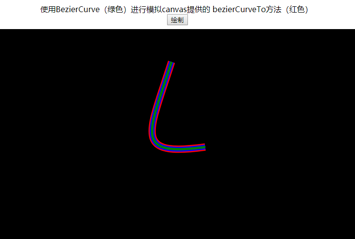
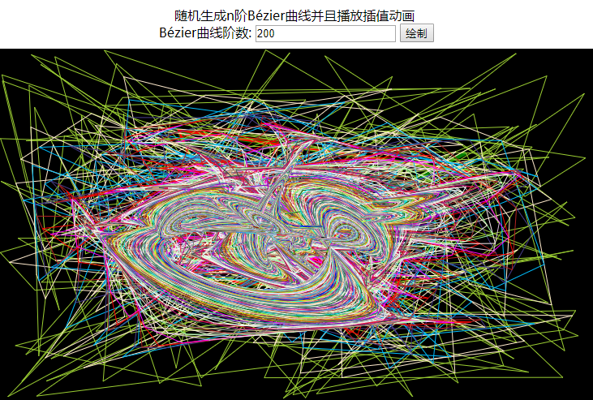
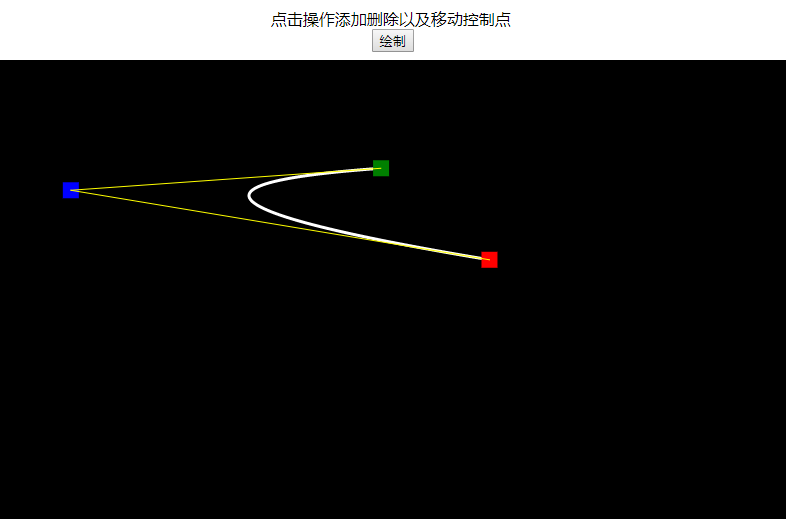

### Bézier曲线
https://wardenfeng.github.io/bezier

创建该库的原始目的是为了解决feng3d引擎粒子中时间与常量的变化曲线问题。

制作Bézier曲线这个库忙了整整3天了，感觉要跳进高等代数的坑了，得赶紧爬出这个坑，这坑太深了，以后再来跳。

#### 核心文件
1. [Bezier.ts](src/math/Bezier.ts) 
1. [Bezier.d.ts](out/math/Bezier.d.ts) 

#### 立方Bézier曲线 [CubicBezier.ts](src/math/CubicBezier.ts)
CubicBezier是最常用到的Bézier曲线，为了提升性能以及简化接口单独从Bezier.ts提取出来。

#### Bezier.ts 提供功能
1. 1次Bézier曲线 
    * 求值 ``` bezier.linear ```
    * 导数 ``` bezier.linearDerivative ```
    * 二阶导数 ``` bezier.linearSecondDerivative ```
1. 2次Bézier曲线 
    * 求值 ``` bezier.quadratic ```
    * 导数 ``` bezier.quadraticDerivative ```
    * 二阶导数 ``` bezier.quadraticSecondDerivative ```
1. 3次Bézier曲线 
    * 求值 ``` bezier.cubic ```
    * 导数 ``` bezier.cubicDerivative ```
    * 二阶导数 ``` bezier.cubicSecondDerivative ```
1. n次Bézier曲线的值  n > 0
    * 求值 ``` bezier.getValue ```
    * 导数 ``` bezier.getDerivative ```
    * 二阶导数 ``` bezier.getSecondDerivative ```
    * N阶导数 ``` bezier.bnND ```
1. n次Bézier曲线的极值列表 ``` bezier.getExtremums ```
1. n次Bézier曲线的区间列表 ``` bezier.getMonotoneIntervals ```

#### [单元测试](tests/index.html)

#### 示例
1. [使用BezierCurve进行模拟canvas提供的 bezierCurveTo方法](BezierCurveTo.html)




1. [随机生成n阶Bézier曲线并且播放插值动画](BezierCurveAnimation.html)



1. [Bézier曲线编辑器](BezierEditor.html)

